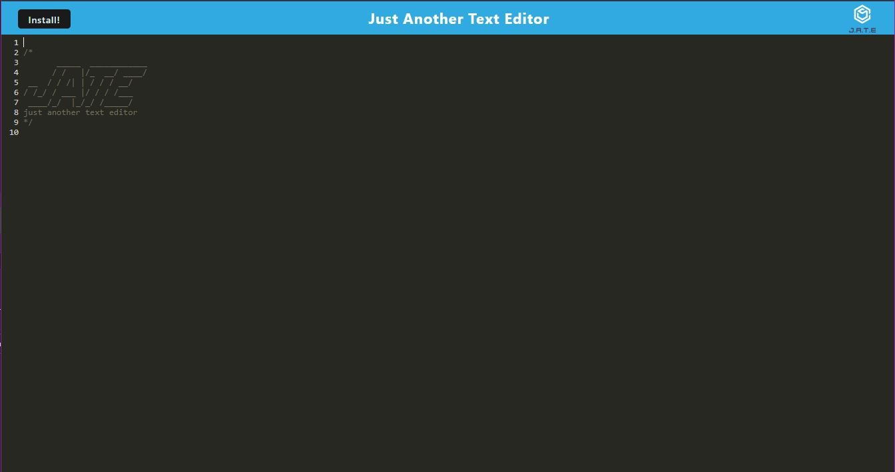

  # JATE(Just Another Text Editor)PWA

  ## Table of Contents
  - [Description](#Description)
  - [Usage](#Usage)
  - [Installation](#Installation)
  - [License](#License)
  - [Contributing](#Contributing)
  - [Tests](#Tests)
  - [Questions](#Questions)
  - [Screenshot](#Screenshot)

  ## Description
  This app is a text editor/note taker that can be installed by clicking the install button.

  ## Usage
  clone the repo or download it, then run npm i, then npm start dev to start the application. Then browse to localhost:3000 to use the application.

  ## Installation
  clone or download the repository, run npm i in the root directory then npm start dev and browse to localhost:3000

  ## Questions
  contact GitHub user ctowns5 with any questions

  ## Contributing
  NA

  ## Tests
  NA

  ## License
  Licensed under the [MIT](https://opensource.org/licenses/MIT) license
  
  
  ## Screenshot
  

  # link to deployed application: https://gentle-ridge-00170-bbb1bef3974d.herokuapp.com

  # github repo: https://github.com/ctowns5/potential-octo-fiesta

 